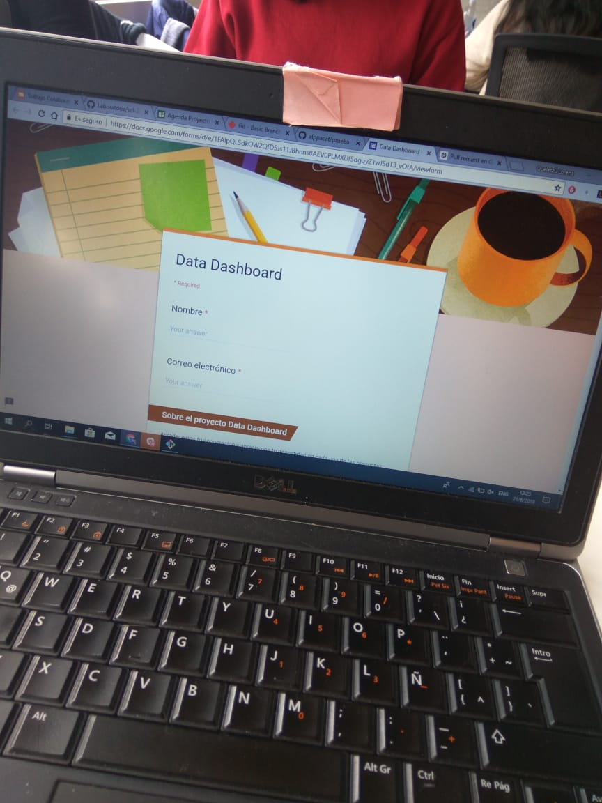
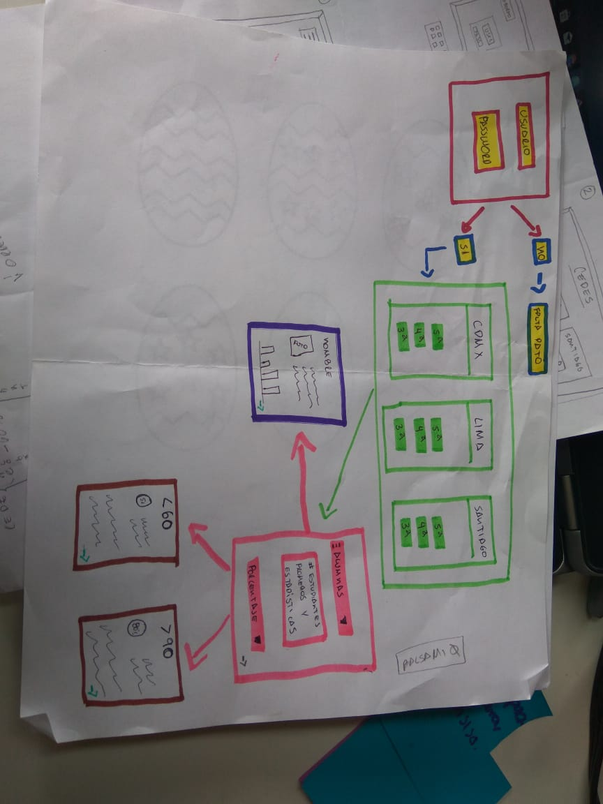
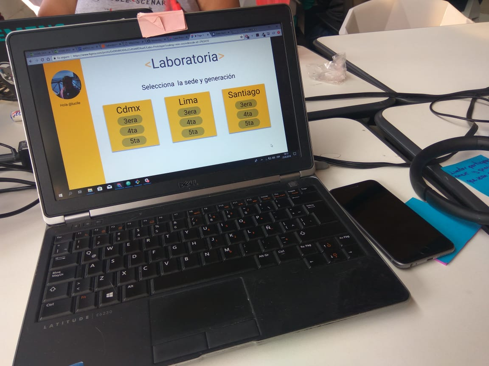
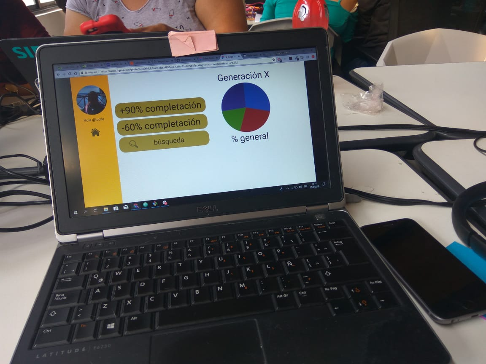

# **Información general**

En Laboratoria, las Training Managers se enfrentan en su día a día al análisis de datos, sin embargo, no cuentan con las herramientas necesarias y adecuadas para hacerlo. Por esta razón se recurrió a ciertas medidas para poder proporcionarles una herramienta cuyo propósito fuera la lectura sencilla y amigable para la interpretación de datos de las estudiantes.
Se decidió hacer un estudio para ahondar en las necesidades de las Training Managers mediante cuestionarios y entrevistas personales.

**Formato de la encuesta realizada**

  

Realización de un sketch de baja fidelidad a partir del análisis de la encuesta así como de las entrevistas realizadas.

  

  

# **Análisis de datos**

Al realizar un análisis detallado de las respuestas recibidas de la encuesta a las siguientes Training Managers:
1. Lucile Baratier
2. Alejandra Ramirez
3. Karla Rejas
4. Valentina Smith
 

Nos dimos cuenta de que no hacen uso en absoluto de una interfaz propia para poder realizar su trabajo. Esto obviamente representa un obstáculo para el fácil acceso a los datos de las alumnas así como el análisis de estos.

>***En caso de no contar con una interfaz ¿Por qué te sería importante contar con una?***
>   Por que me ayudaría a dar feedback oportuno a nuestras estudiantes, y tener la información en un solo lugar y a tiempo real. Sería feliz!!

El contar con una interfaz ayudaría a la agilización y optimización del trabajo, por esta razón se decidió implementar un *Data Dashboard*, una herramienta amigable y visualmente atractiva cuya función sería, como ya mencionado anteriormente, hacer el trabajo de las Training Managers ameno y que responda a sus necesidades.

 ## Prototipo de baja fidelidad

 Después de trabajar con el sketch se llegó a la decisión de hacer un prototipo de la interfaz.

 

   
 

 

 

Al ser el primer prototipo y ponerlo a prueba se llegó a la conclusión junto con nuestra usaria (Lucile) de que es necesario hacer algunos cambios al momento de obtener los datos y estádisticas de las alumnas.
