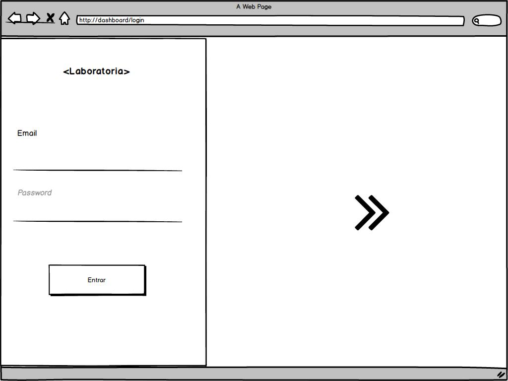
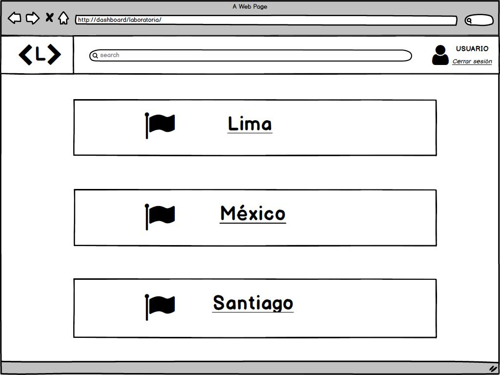
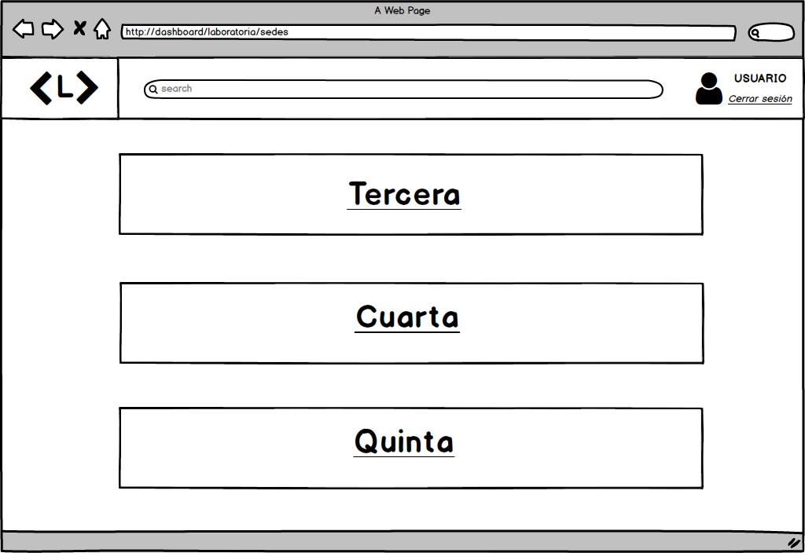
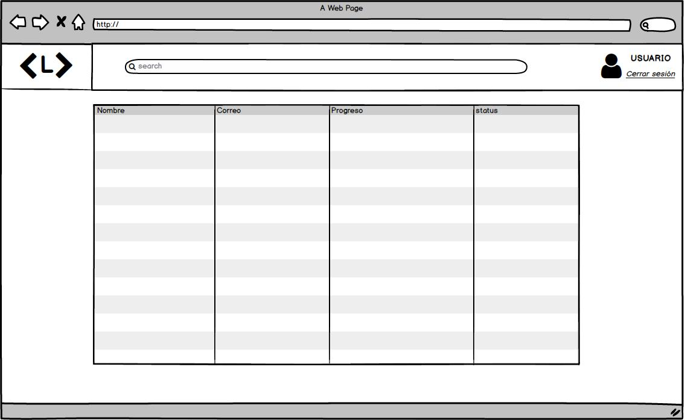
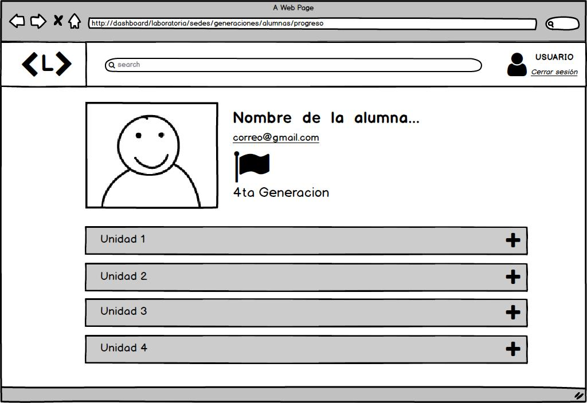
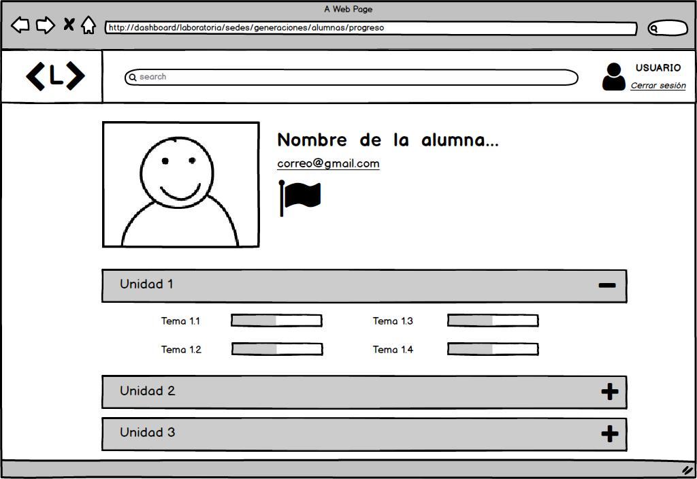

# **Data Dashboard**

## **Proceso de UX**
Para la fase inicial es necesario enfocarnos hacia el cliente y usuario con el propósito de conocerlos, saber cuales son sus necesidades y requerimientos.

En base a ello comenzamos con el proceso de diseño, donde pasamos por diferentes etapas como:

### **1. Descubrimiento e investigación**
Laboratoria es una Asoción sin fines de lucro comprometida con el desarrollo y la inclusión de mujeres en el sector Tech.

Una de las actividades diarias de Los Trainin Managers y el personal de Laboratoria, es el proceso, seguimiento y análisis de las estudiantes durante el bootcamp. Esto con la finalidad de apoyar a las estudiantes con su aprendizaje y ver como funcionan las implementaciones durante el desarrollo del mismo.

En este proyecto nuestro objetivo principal es crear una base de datos la cual llameremos Lab-dashboard que permita al personal de Laboratoria principalmente TMs y Coaches monitorear el proceso de cada una de las estudiantes (coders) dentro del Bootcamp y su interacción con el LMS (Learning Management System), este es un sistema de aprendizaje que permite a las estudiantes adquirir o reforzar conocimientos a través de lecturas, videos, ejercicios y quizzes.

Cabe mencionar que en Laboratoria el progreso en el LMS (lecturas leídas, videos, quiz y ejercicios realizados) no afectan directamente a las evaluciones de las estudiantes. Ellos toman más esa data obtenida para la ayuda y mejora tanto de estudiantes como de las estrategias implementadas.

Podemos concluir y sintetizar diciendo que Lab-dashboard es una herramienta utilizada por Training  Managers, coach y personal que interviene en la consecución de los objetivos de Laboratoria, y que está orientada a la toma de decisiones para optimizar la estrategia.

La principal problemática de mi usuario es que actualmente Laboratoria no cuenta con un data dashboard y la información la manejan por medio de Excel pero el proceso para acceder es complicado  y les consume tiempo.

__Usuarixs:__  La información que recopilamos la obtuvimos mediante entrevistas a Lucile Baratier (Training Manager,  Laboratoria CDMX) y Yujy (Alumni Network Manager, Laboratoria CDMX).

__Necesidades de las usuarias__

Nos dimos cuenta que la necesidad principal de crear un data-dasboard es poder visualizar la información de forma rápida y eficaz y que está a su vez sirva para tomar decisiones a tiempo, dar solución o mejorar aún más la experiencia durante el Bootcamp

Tomando en cuenta sus opiniones los datos a visualizar serían los siguientes:

* Sede del campus.
* Generación.
* Datos de la estudiante (nombre, e-mail, progreso y duración de temas).
* Número (porcentaje) de estudiantes que siguen activas vs las que desertaron
* Status inferior al 60% y superior al 90% de completitud
* Progreso general de generación y sedes 

En este dashboard trabajaremos con 3 Sedes:
* Lima
* CDMX
* Santiago

Así mismo las generaciones que estaremos trabajando serán tercera, cuarta y quinta.

Y estos datos estarían protegidos, ya que sólo personas autorizadas (que tengan usuario y contraseña) podrán acceder a dicha información.

Los usuarios estarían accediendo a la plataforma como mínimo 5 días a la semana  por medio de computadoras (escritorio o laptop) y celulares.

Así mismo queremos simplificar al máximo la usabilidad de la plataforma  para sea amigable, esto por medio de información precisa y clara, botones visibles y en el lugar adecuado y que la plataforma sea sencilla de usar para que así  nuestro usuario emplee su tiempo de manera asertiva y eficaz, permitiéndole realizar otras actividades de su vida cotidiana. 

__Pain points:__ 
Tomando en cuanta la herramienta utilizada (excel) para la consulta y manejo de datos en grandes cantidades, es difícil y en ocasiones llega a ser un poco tedioso acceder a información específica que requieren.

__Sentimientos:__Por medio de las entrevistas nos pudimos percatar que existe un poco de frustración porque excel les es útil pero no es la mejor opción para manejar una gran cantidad de datos ya que se tienen que seguir una serie de pasos para llegar a cierta información que se desee consultar, así mismo influye también el tiempo que esto les toma.

__Técnicas usadas en esta fase:__ 

####Entrevista  Lucile Baratier (Training Manager, CDMX)

**Platicanos un poco de cómo accedes a la información de las alumnas.**
Actualmente no contamos con un data dashboard pero es super importante ya que un data básicamente es una manera de visualizar la información que te sirve para tomar decisiones.
Les daré un ejemplo muy sencillo: si en CDMX aceptamos a 90 estudiantes y en una semana se van 20 (probablemente sea porque algo estamos haciendo mal) y en Santiago solo se fueron 2, la data sirve para analizar y hablar con coaches y TMs y así generar una estrategia diferente.

**Nos comentas que no tienen data dashboard, nos gustaría saber ¿cuál es la forma en que manipulan la data?**
Usamos excel pero es muy complicado, tenemos que meternos en muchos archivos, no están filtrados y es difícil su manipulación, super lento y super largo.

**Ya has tenido alguna experiencia de usar un data dashboard fuera de Laboratoria?**
No, pero se muy bien el valor que me daría tenerlo y me ahorraría un buen de trabajo.

**Cuál sería el orden de importancia de la información?**
* Sedes
* Generación 
* Cuántas estudiantes están activas
* Cuantas estan activas vs inactivas
* Nivel de completitud
* Quienes están por debajo del 60% y por encima del 90% del LMS

**Consideras algo que no se mencionara que sea importante que esté en la interfaz?**
No sobrecargar la página y tener un filtrado, así como información global.

**Qué es lo más importante que debería de tener la data para ser manipulada por los TMs?**
Poder filtrar.

**Qué problemas has enfrentado con el manejo de datos manejandolos en excel?**
poca visibilidad que tienes, tienes que buscar para poder obtener un número y lo que el data te hace automáticamente uno lo tiene que hacer manualmente.

**Cómo podriamos mejorar tu experiencia de usuario?**
No necesariamente tienen que ser gráficas pueden ser números, pero si necesito saber el porcentaje, que sea muy visual para poder tomar una decisión de forma rápida porque la data es fácil de entender

**Qué dispositivos usarías para manipular la data?**
Computadora y celular

**Quiénes utilizarían el data?**
Principalmente los TMs, considero que lo más sencillo sería hacer un login para tener protegida la información

**Te gustaría agregar algo más a la data?**
Sí que pudieran crear perfiles, sería excelente, se los dejo en la mesa! 
Y recuerden que entre más sencillo mejor.

####Entrevista Yujy (Alumni Network Manager, CDMX).

**En qué dispositivo accederás al data dashboard?**
En una computadora, ya que es mucha información la que se visualiza, aunque también usaría celular en cuestiones especiales donde no tenga una computadora cerca.

 **Con qué frecuencia accederás a estos datos?**
Diario

**Cómo jerarquizarias la información?**
* Código de estudiante
* Nombre (datos personales)
* Generación 
* Sede

**Requieres que se agregue alguna data más?**
Si, como evolucionan las egresadas, tanto en el trabajo como en su vida personal, su situación económica, si siguen aprendiendo (cursos, talent land, etc) si necesitara sus meses de gracia (pago), etc.

**Crees necesario que se acceda a la información mediante un usuario?**
Sí, porque así vemos quien manipula la información y estaría genial!
Les recomiendo también que se pudiera actualizar datos (fueran modificables).

**Las herramientas que utilizas actualmente cubren tus necesidades?**
Si, pero son complejas, utilizamos Drive y manejo alrededor de 8 excel donde está toda la información en diferentes lugares.

**Te gustaría un filtro de búsqueda?**
Sí sería muy bueno.

__5. Objetivos del negocio:__ 

Crear un data dashboard intuitiva que facilite el proceso de trabajo de lxs TM´s y personal de Laboratoria. Es decir, que sea fácil de entender y los datos que se muestren sean concisos.

Siguiendo las necesidades de nuestros usuarios tomas los siguientes puntos:

* Facilitar la visualización de información de las alumnas y que está a su vez sea clara y concisa.
* Darse cuenta a tiempo de problemáticas que se lleguen a presentar.
* Poder tomar decisiones de una forma más rápida y eficaz. 
* Ver la funcionalidad de estrategias y de ser necesario mejorarlas

__6. Motivaciones del negocio para el data dashboard:__

* Agilizar el proceso de trabajo de las TM´s y personal de Laboratoria
* Crear una mejor experiencia para el usuario realizando una interfaz intuitiva y amigable.
* Que el usuario pueda focalizar problemas de forma rápida para poder dar solución lo antes posible, así mismo pueda ver la eficiencia de ciertas estrategias implementadas 
* Que nuestro usuario pueda optimizar su tiempo.
* Que gracias a esta Lab-dashboard la experiencia tanto del personal como de las estudiantes de Laboratoria sea lo mejor posible.

__6. Proceso de diseño:__

Principalmente nos enfocamos en recopilar las necesidades y requerimientos de nuestro cliente y usuario.
Pensamos en el diseño y colocación de botones para hacer la plataforma lo más amigable posible.
Hicimos varios bocetos (sketch) de la visualización de nuestro producto para así llegar a nuestro prototipo de alta fidelidad y con ello implementar el diseño a Lab-dashboard

### **2. Síntesis y definición**

__1. Cuáles crees que son los datos más importantes a tener en cuenta para el Data Dashboard:__

   - Sobre las estudiantes:

   **Nombre/datos generales**
   **Estudiantes por debajo del 60%**
   **Estudiantes por encima del 90%**
   **Avance general de completitud de temas**
   **Estudiantes activas e inactvas**

   - En general:

   **Porcentaje concreto de avance por generaciones y Sedes**

__2. Lo que los usuarios esperan obtener:__
Poder accesar facilmente a la información (avance de las estudiantes, generación o sedes).
Poder filtrar y obtener un dato en específico por estudiante, generación o sedes.

__3. Insights:__

__4. Data proporcionada:__ 

     -_Data relacionada a los cursos:_

**Sedes**
**Generaciones(tercera, cuarta y quinta)**
**Estudiantes (nombre, correo, turno)**
**Porcentaje de complititud**
**Temas y subtemas (duración y porcentaje de completitud)**

__5. Insights del negocio:__

### **3. Ideación**
Para solucionar el problema de nuestro cliente pensamos en crear un data dashboard, el cual les permita a los TMs y personal de Laboratoria analizar la información de las estudiantes, así como ver el progreso en general de las otras sedes para poder resolver conflictos, ver avance general y poder realizar cambios o mejoras.

### **3.1 Pseudocódigo** 
Se propone un total de cuatro views: login, sedes, generaciones y alumnas. Login: en el cual el usuario debe ingresar con su e-mail o nombre de usuario y contraseña, después accederá a view-sedes.
View-Sedes: en esta página se podrá observar el logo de laboratoria <L> un icono de usuario, log-out y 3 botones los cuales contienen el nombre de las Sedes, al darle click en alguno de ellos pasa a view-generaciones.
View-Generaciones: en esta página al igual que en view-sedes se podrá observar el logo de laboratoria <L> un icono de usuario, log-out y 3 botones (aquí la diferencia) los cuales contienen las 3 generaciones y al darle click en alguno de ellos pasa a view-alumnas. 
View-Alumnas: en esta página al igual que en view-sedes y view-generaciones se pueden acceder a datos de las alumnas como nombre, correo, porcentaje de completitud e identificar que estudiantes están por debajo, en la media y sobresaliente.

### **3.2 Paleta de colores**
https://ibb.co/i9yZsJ

### **4. Prototipado**
A continuación mostramos nuestro sketch y prototipo los cuales son nuestro primer diseño pensando en las necesidades del usuario, en que fuera fácil de usar y manipular.

**Sketch:** 

**Sketch con Feedback aplicado:**

Login

Sedes

Generaciones

Alumnas

**Prototipo en figma:** 

Login
https://www.figma.com/file/FuQsDKh5REXsC4Zu6aZkLK2U/Untitled

Sedes
https://www.figma.com/file/FuQsDKh5REXsC4Zu6aZkLK2U/Untitled?node-id=7%3A0

Generaciones
https://www.figma.com/file/FuQsDKh5REXsC4Zu6aZkLK2U/Untitled?node-id=10%3A31

Alumnas
https://www.figma.com/file/FuQsDKh5REXsC4Zu6aZkLK2U/Untitled?node-id=10%3A63

### **5. User testing**

Nos acercamos a Lucile para recibir Feedback y es por ello que decidimos cambiar el diseño original de nuestra Lab-dashboard.

### **6. Argumentación de Visual Desing

Después de conocer a nuestro cliente en este caso Laboratoria, decidimos utilizar los colores de la empresa, ya que también están inovando con nuevo Logo e implementando nueva paleta de colores.
Dentro de esta implementación optamos por los colores amarillo y rosa. Para darle un toque de equilibrio entre estos 2 colores utilizamos el color gris.

* Logo: optamos por el siguiente logo <L> La letra "L" dentro de símbolos de mayor y menor que, los cuales nos introducen al mundo del código, ya que estos tienen constante presencia ya sea para etiquetas o en la implementación de código en si.

* Login: Los símbolos de mayor que y el slogan <Labortoria> talento que transforma presentados en el login los elegimos pensando en hacer viaulmente agradable y dinámica la primera impresión que tenga nuestro usuario al interactuar con la página principal de nuestro Lab-dashboard.

* Colores: 
- Rosa representa lo femenino y como ya mencionamos antes, Laboratoria es un Bootcamp de puras mujeres!
- Amarillo representa el optimismo, tránsmite felicidad, abundancia y por otro lado lo asocian un poco con el color naranja ya que despierta el apetito y consideramos que en este caso no se trata de comida 😁 sino que despierta el apetito de aprender a aprender en todos los ámbitos, para así adquirir las herramientas para el mundo laboral.
- Gris transmite seriedad y elegancia.

