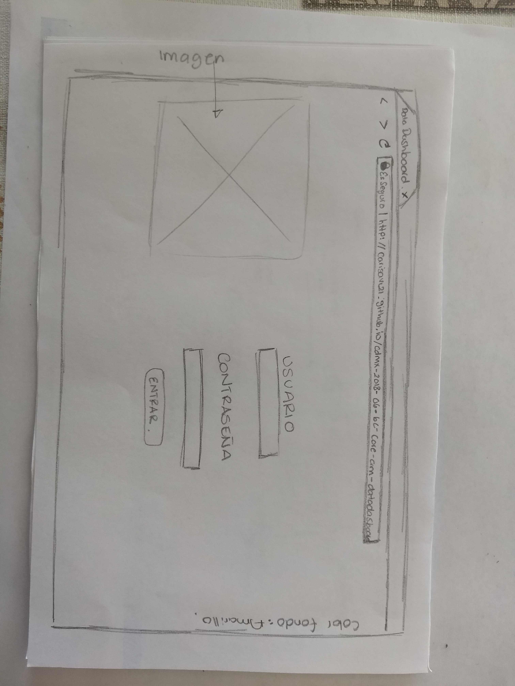
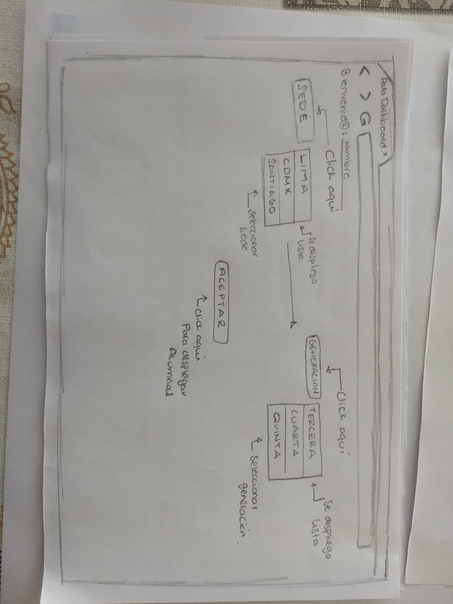
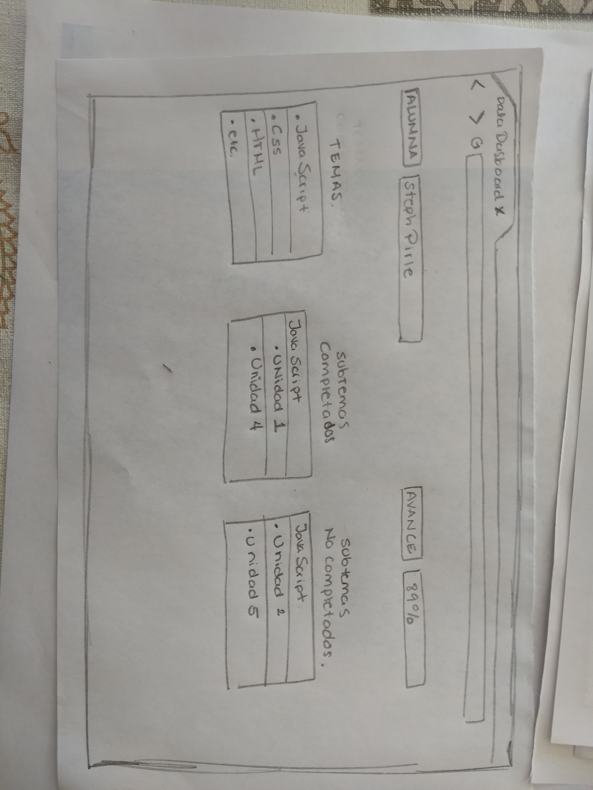
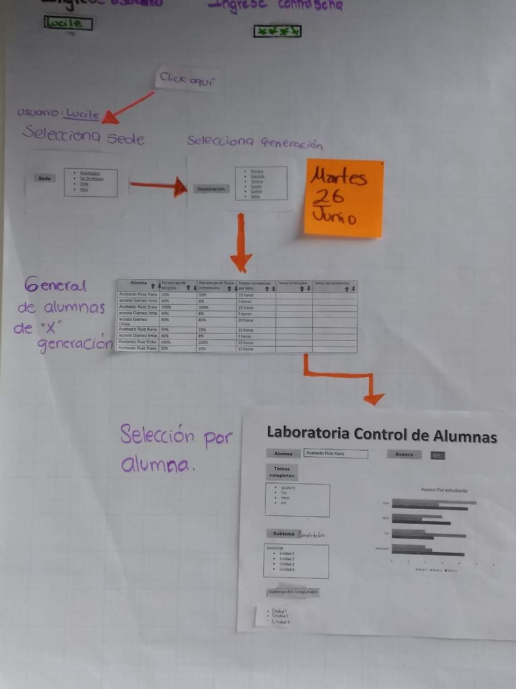
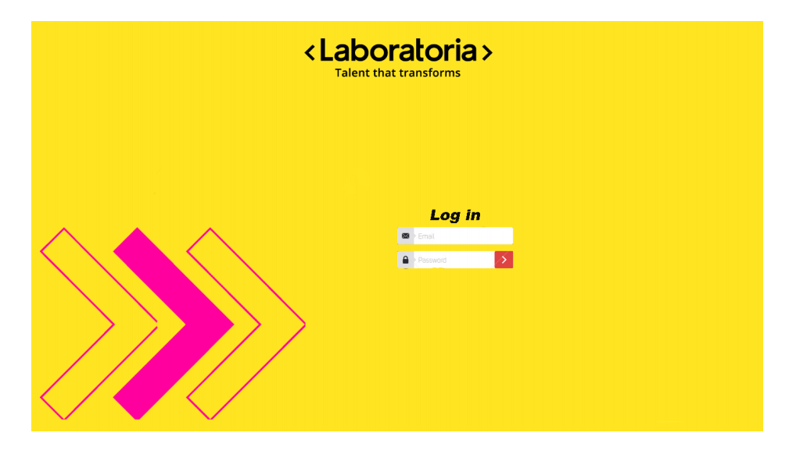
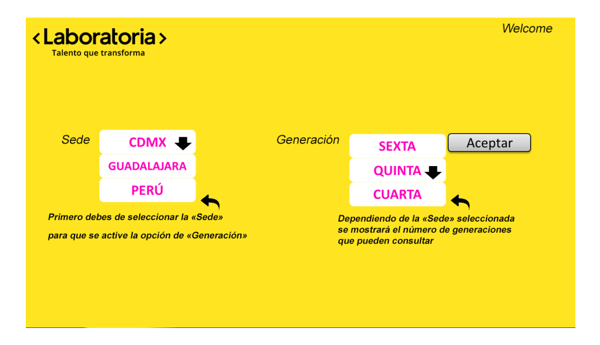
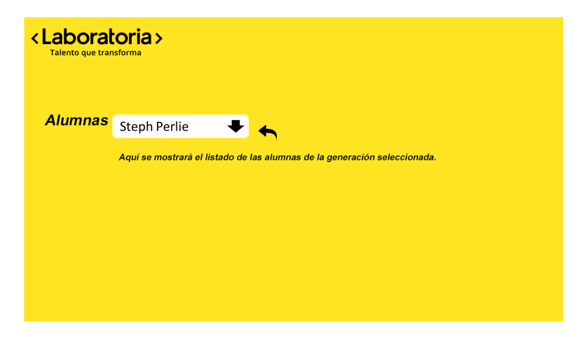

# **Data Dashboard**

### **1. Descubrimiento e investigación**

En Laboratoria, las Training Managers (TMs) hacen un gran trabajo al analizar la mayor cantidad de datos posibles respecto al progreso de las estudiantes para apoyarlas en su aprendizaje.

La principal medida de progreso de una estudiante en Laboratoria es su avance completando los proyectos de la Ruta de Aprendizaje y su desempeño en función a la Rúbrica de Niveles Esperados. Sin embargo, para completar estos proyectos las estudiantes acceden a contenidos de aprendizaje (lecturas, videos, ejercicios y quizzes) en un sistema que llaman LMS (Learning Management System). El LMS acumula data sobre quién leyó qué, qué ejercicios se han completado, los resultados de los quizzes, etc.

Para llevar a cabo esta  investigación nos apoyaron las siguientes Training Managers:

* Lucile Baratier de Ciudad de México
* Karla Rejas de Guadalajara, México
* Alejandra Ramirez  de  Lima, Perú

Con la primera Training Manager Lucile Baratier, se realizó una entrevista contextual  en la cual se le pudo observar  en su ambiente laboral y la manera en la que hacía uso de las herramientas para poder acceder al progreso de las estudiantes de Laboratoria. La herramienta que utiliza todos los días para conocer el avance de las alumnas es a través de Spreadsheets de Google drive en el cual busca las carpetas de selección, formacion e insercion laboral, accede en primer lugar  a la carpeta de formación, elige la sede que le corresponde y la generación que necesite, si necesita saber cuántas estudiantes se encuentran activas  tiene que buscar en otra carpeta llamada asistencia y contabiliza las estudiantes que no se han dado de baja. Nos comparte que no todas las sedes  tienen la misma representación de información, difieren y  se encuentra dispersa.

Con las Training Managers  Karla Rejas y Alejandra Ramírez, se realizó una encuesta  y se envió vía correo electrónico, debido a que no contaban con el suficiente tiempo para poder  realizar una videollamada. Ambas coincidieron con la Training Manager de la sede de Ciudad de México  que utilizan Spreadsheets de Google drive, indican que su utilidad no es muy funcional porque es mucha información que deben sistematizar a través de fórmulas, y no está en un formato amigable a la vista. Lo utilizan porque es la única herramienta que tienen  para procesar la data del progreso de las alumnas. La Training Manager de Guadalajara indica que utiliza Spreadsheets de Google drive todos los días al igual que la sede de Ciudad de México y la  Training Manager de Lima, Perú solo al final de cada proyecto.

Las tres Training Managers coinciden que los datos más relevantes que les agradaria visualizar son: número total de estudiantes, número de deserciones,  porcentaje de avance en LMS (Learning Management System).

Al contar con el acercamiento a las Training Managers  podemos  identificar los siguientes puntos:

1. Objetivos de las Training Managers:

Conocer el avance de cada una de las alumnas  y por generación del LMS  (Learning Management System) para poder tomar decisiones que ayuden a mejorar su proceso de aprendizaje.

2. Pain points (Puntos de Dolor del usuario):

* Ir de archivo en archivo para obtener información del progreso de las alumnas
* Les absorbe demasiado tiempo
* Cálculos manuales
* No es fácil de utilizar
* Información dispersa
* Spreadsheets tarda en  cargar  por tanta información
* No es uniforme la información en todas las sedes

3. Sentimientos que le generan al usuario al utilizar Spreadsheets:

* Tedio
* Frustración
* Apatía

Podemos concluir que a pesar de que la data de progreso del LMS (ej. lecturas leídas, ejercicios completados, nota en quizzes, etc.) no impacta directamente en la evaluación de una estudiante, sí es una pieza de información relevante que las TMs quisieran visualizar para tener un mejor entendimiento de cómo va cada estudiante en su proceso de aprendizaje.

Ya contamos con información y acercamiento de las usuarias (TMs) ahora también es importante tener en cuenta los objetivos del negocio, en este caso los de Laboratoria.

__Objetivos del negocio de Laboratoria:__

* Traer a más mujeres al mundo laboral, y en especial al sector de tecnología.
* Transformar la educación

__Motivaciones del negocio:__

* Contar con una interfaz donde las TMs de todas las sedes cuenten con la data uniforme del progreso de cada   una de las alumnas y por generación.
* Realizar mejoras en el LMS (Learning Management System).
* Entender mejor su negocio y tomar decisiones apropiadas.

### **2. Síntesis y definición**

__1. Cuáles crees que son los datos más importantes a tener en cuenta para el Data Dashboard:__

* Número total de estudiantes activas e inactivas  por generación.
* Niveles de completitud del LMS
* Porcentaje de completitud alto
* Porcentaje de completitud que estén en el promedio
* Porcentaje de completitud bajo
* Porcentaje del avance total del grupo

__2. Lo que los usuarios esperan obtener:__

* Visualizar la información fácil
* Automatizado y procesado
* Poder tomar decisiones
* Muy entendible
* Visualizar perfil por perfil
* Poder filtrar por sede, generación

__3. Insights:__

* Número total de estudiantes activas e inactivas  por generación.

__4. Data proporcionada:__

* Sedes
* Generaciones
* Porcentaje general de completitud de c/estudiante
* Porcentaje de completitud de todos los temas
* Porcentaje de tiempo completado de cada tema
* Subtemas de cada tema
* Subtemas completados y no-completados de cada tema
* Subtemas por tipos (ejercicios, lecturas y quizzes)
* Promedio de la generación
* Status para identificar estudiantes debajo del 60 en su porcentaje de completitud
* Status para identificar estudiantes con 90 o más en su porcentaje de completitud
* Nombre de estudiantes

__5. Insights del negocio:__

* Entender mejor su negocio y tomar decisiones apropiadas.

### **3. Ideación**

Una interfaz donde las TMs puedan ver y usar la data de progreso del LMS, para ello, proponemos crear un data dashboard (tablero de visualización de datos).

### **4. Prototipado**

### **5. User testing**

Se presento el prototipo del Data Dashboard a Karla Rejas (Training Manager de Guadalajara), nos comenta que el diseño y los colores van acorde a la identidad de Laboratoria, el Dashboard es fácil de interpretar e intuitivo.

### **6. Argumentación de Visual Design**

<Laboratoria> ya cuenta con una identidad por eso decidimos que el Data Dashboard tendría  el amarillo como color principal y magenta. Se agregaron los corchetes ya que  son su principal símbolo y son vistos como los símbolos del progreso y la transformación.

La tipografia que se utilizo es “Bitter” para los títulos y una “Open sans” para los textos, es contundente al expresarse por escrito, pero liviana al leer.

Por ultimo se incluyo el slogan, “talento que transforma”, ya que enriquece su identidad visual.  

## **Se anexa la encuesta que se envio a las TMs de Guadalajara y Lima**

1.    ¿Qué herramientas utilizas normalmente para consultar la data de las alumnas de Laboratoria?

2.    ¿Qué tan funcional es? ¿Por qué?

3.    ¿Con que frecuencia consultas esta información?    

4.    ¿En algún momento has sentido que estas herramientas obstaculizan el flujo de tus actividades?

5.    ¿Cuáles son los datos más relevantes que te gustaría que mostrara la interfaz?

6.    ¿Normalmente en que dispositivos monitoreas estos datos?
