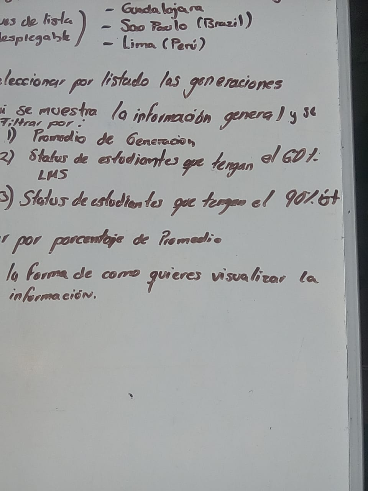
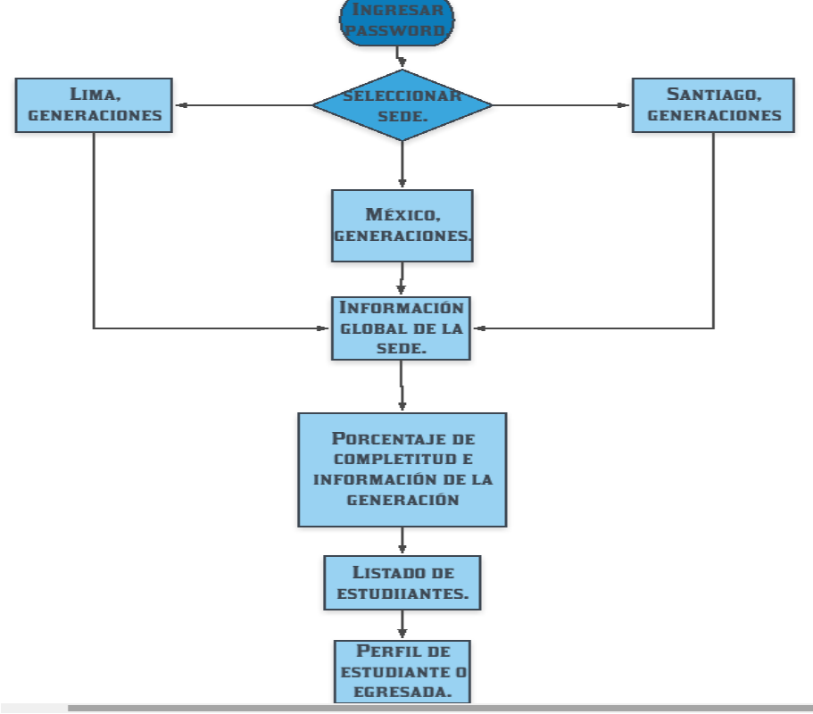
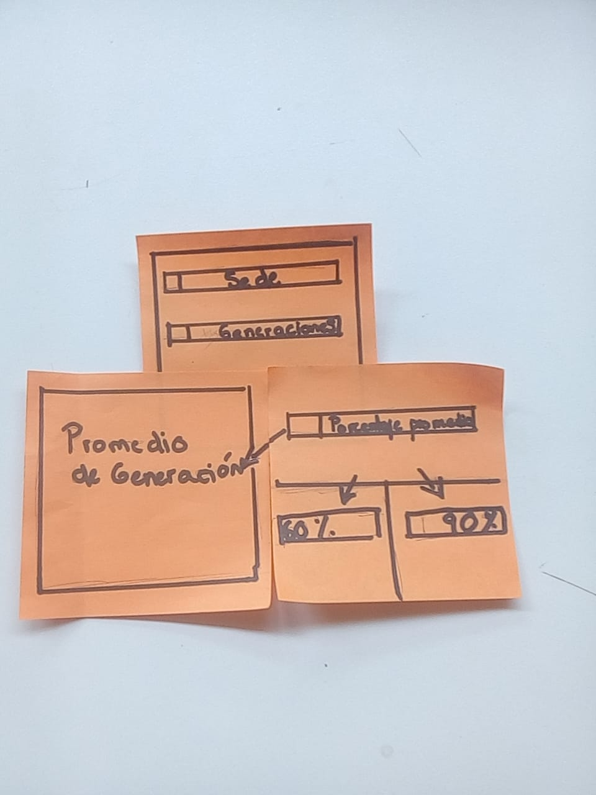
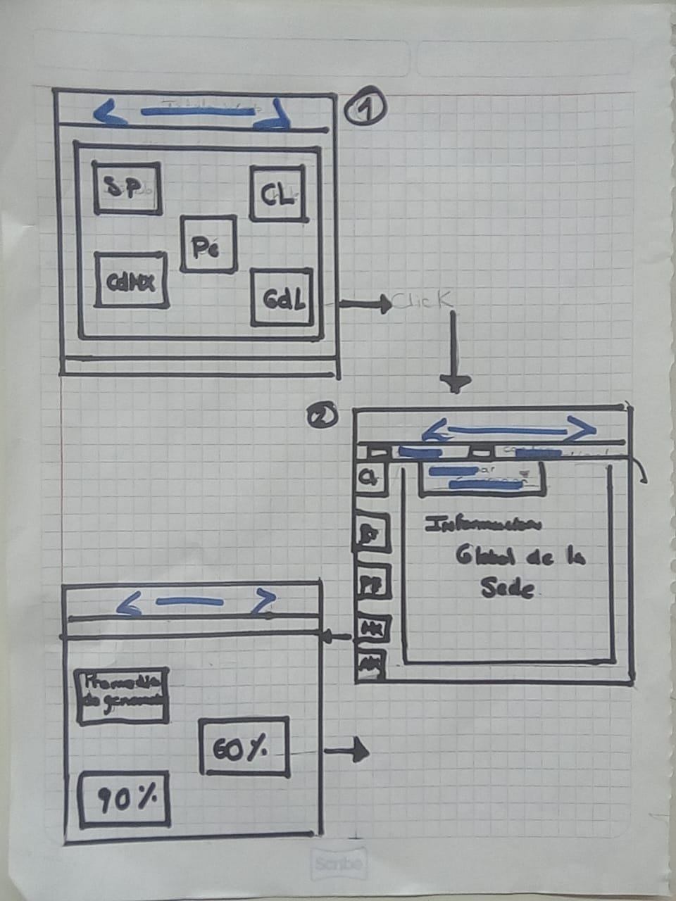
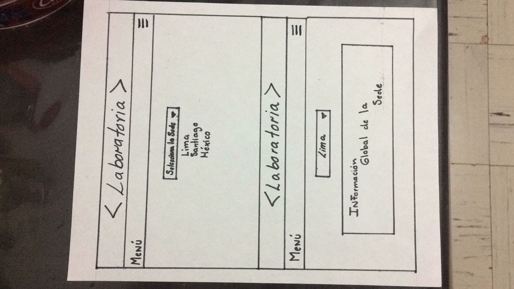
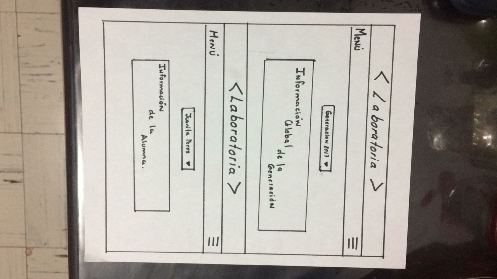

<<<<<<< HEAD
# **Data Dashboard**

## **Proceso de UX**

Nuestro primer acercamiento lo haremos a través del proceso de diseño, donde pasamos por diferentes etapas como:

### **1. Descubrimiento e investigación**
(En esta fase es donde vamos a tener ese proceso de investigación y acercamiento con el usuario, es donde vamos a obtener el conocimiento para poder saber a quién vamos a llegar, pero de manera más profunda. Es tener la empatía y el acercamiento necesario para conocerlo.

También vamos a tener en cuenta al negocio, sus objetivos y a los stakeholders(involucrados)).

__Usuarixs:__  (Toda la información que sepas de ellxs, ya sea porque las has podido observar o porque obtuviste datos directamente de ellas)

__Necesidades de las usuarias:__

__Objetivos de las usuarias:__ (Lo que quieren o esperan lograr)

__Pain points:__ (En sus actividades diarias qué es lo que más les molesta u obstaculiza en el proceso de  realizar sus actividades/objetivos)

__Sentimientos:__(Sentimientos que les surgen dentro del proceso de sus actividades. Identificar cuáles predominan)

__Técnicas usadas en esta fase:__ (Sabemos que en este punto, tal vez, sólo has ocupado encuestas, no te olvides de documentar este proceso de recolección de datos)

__5. Objetivos del negocio:__ (Enlistarlo(s))

__6. Motivaciones del negocio para el data dashboard:__(Enlistarlo(s))

### **2. Síntesis y definición**
(Dada la fase anterior de investigación, ahora vamos a tomar todos los datos más importantes y transformarlos en información valiosa para comenzar a orientarse a la solución. También vamos a entender lo que la empresa quiere de ese producto y comenzar a entender ambas visiones con el fin de encontrar un punto armónico)

__1. Cuáles crees que son los datos más importantes a tener en cuenta para el Data Dashboard:__

   - Sobre las estudiantes:
 

__2. Lo que los usuarios esperan obtener:__

__3. Insights:__

__4. Data proporcionada:__ 

     -_Data relacionada a los cursos:_

__5. Insights del negocio:__

### **3. Ideación**
(Acá se comienza a pensar esa solución tomando en cuenta la información recopilada y procesada)

### **4. Prototipado**
(Esta es la fase creativa, donde se comienza a construir el Data dashboard con la información obtenida de las fases anteriores. Se reafirma crear la experiencia de usuario, donde la solución resuelve necesidades y facilita la vida)

Sketch: (Adjuntar liga)

Prototipo en figma: (Adjuntar liga)

### **5. User testing**
(Si deseas validar tu propuesta, acércate a tu usuario y que te de feedback con el fin de mejorar tu producto en beneficio del negocio y de tu usuarix).
****
=======
# Data Dashboard

## Definición del usuario.

El producto esta dirigido para todo el staff de laboratoria.

## Objetivos del usuario.

Requieren una herramienta que les simplifique el proceso de obtención de datos definidos que les permitan llegar a soluciones en base a estadíticas.

## Pseudo código.
En el inicio se genero un pseudo código en el cual implementamos las acciones que normalmente se deberían generar en una aplicación correctamente estructurada.

## Diagrama de flujo.

Posteriormente se genero un diagrama de flujo pensando en la organización de los elementos que se aplicaran para este Data Dashboard.

## Creacion del Sketching, antes de la entrevista.

Al inicio de la creación del sketching nos enfocamos en diseños básicos  tomando en cuenta una investigación generada en internet en la cual hay ejemplos muy claros de lo que se ha diseñado con anterioridad, para nosotras es importante que el usuario pueda tener la suficiennte interacción con la aplicación y le sea funcional. Trabajamos con el supuesto  de que requieren la información en tiempo real y que además es un contenido que se revisa diariamente  y que necesita ser actualizado con la misma frecuencia. Generamos sketchinn que nos permitieron tener una idea más clara de lo que el cliente requiere.

## Posterior a las entrevista. 

 
### Aplicaciones usadas actualmete.

Actualmente el equipo de Laboratoria se desempeña en sus roles y acceden a la información recopliada através de Gogle Drive y generan distintas bases de datos propias en las cuáles van actualizando la información gradualmente, esto les lleva a generar muchas tablas en excel en las que vacian el contenido. Esto genera conflictos ya que llegado un punto, no saben cuál es la que tiene la información que requieren. 

### Acceso a la información.

Una vez generada las  entrevista con las Training Manager nos dimos cuenta que el acceder a esta información les era complicado ya que tenia que hacer una busqueda incanzable para encontra los archivos necesarios dentro del Google Drive, lo cual les quita mucho tiempo que podrían estar utilizando para otras actividades, además de estar todo el tiempo tratando de recordar los datos que constantemente les piden en su entorno laboral es complicado, pues la data se actualiza todo el tiempo por lo cual requieren de una herramienta que les permita acelerar los procesos de fioltración para de acuerdo a eso, tomar las desiciones correspondientes de acuerdo a la situación. 

### Los equipos más usados.

Los equipos que más utiliza son la computadora y el celular, ya que en su día cotiadiano se le pide información acerca de las estudiantes de las distaintas sedes. Si  se encuentra en su oficina, desde su computadora puede ingresar a los datos, sin embargo le es complicado ingresar a la información ya que los sistemas que actualmente utiliza son rudimentarios y muy básicos. Ahora bien, cuando es necesario el reunirse con un cliente en un ambiente distinto al de su oficina también es complicado, pues al llevar su computadora tiene que volver a ingresar a Gogle Drive para acceder a la misma o recurre a su memoria. Por lo cual le sería más sencillo que el proyecto se pudiera adptar a un celular.

### Frecuencia del usu de la aplicación.

Las training Manager y en general el staff de colaboración generan el ingreso a diario de esta data, por lo cual se tiene en visión que la aplicación también se estaría usando con la misma frecuencia.

### Jerarquización de la información.

Datos más importantes.

a) Lo primero que debe aparecer en la pantalla son las sedes de  las cuales poder decidir a cual va a ingresar, además de esto necesita poder comparar cada sede con la sede de la Ciudad de México, esto le permite tener una visión más general de las acciones que debe tomar o si hay algun cnflicto con la organización del programa.  

b) Ingreso a las generaciones.

c) Necesita saber el número de personas que se encuentran activas en la sede comparado con las personas que desertaron en el proceso.

d) Nivel de completitud del LMS.

e) Requiere que una vez procesada esta información le permita ver un perfil donde le indique individualmente los datos de cada estudiante.

Como un adicional mencionan que les sería muy útil tener los datos de las egresadas, ya que por este medio pueden localizar a las mismas y ver como se encuentran actualmente en su lugar de trabajo y en general como se estan desarrollando en su ambiente, tanto laboral como personal.

### Requerimentos adicionales.

Debido a la información que maneja el Data Dashboard es necesario implementar una cuenta de usario y una contraseña, ya que los datos contenidos en esta son vulnerables.

Durante el proceso de las enytrevistas captamos que para la mayoria de los usuarios les es más facíl que tenga un buscador en dode se pueda ingresar el nombre de la estudiante en cuestión y que les arroje el prefil de esta.

## Creación del Sketching posterior a las entrevistas.

De acuerdo a nuestra investigación se determino que el producto se iba a generar de lo general a lo párticular, es decir que se daría prioridad a los datos que los usuarios tienen la necesidad de ver más. Por lo cuál se crea el siguiente sketching:

## Resolución  de los conflictos presentados por el usuario.

El Data Dashboard se implementó para hacer el entorno laboral del usuario más sencilla, este producto les permite recpopilar la información de las estudiantes en tiempo real y se actualiza constantemente debido a ello, los usuarios pueden hacer distintas actividades sin pasart demasiado tiempo analizando los datos de cada sede y cada estudiante que existe en Laboratoria.

## Proceso de diseño.

Durante los primeros días se generaron sketchin de prueba que nos permitieron llegar con el usuario para preguntarle por sus necesidades, debido a ello, las necesidades del mismo quedaron claras y especificas, el mostrar el sketching a un usuario nos permitio que el mismo se diera cuenta de cual diseño le funcionaba más, y cual otro tenia algunos conflictos, por lo mismo se creo una fución de todo lo que el usuario requiere y se llego a la conclusion de que se tenia que hacer un diseño funcional con colores minimalistas y que fuera sencillo de entender. Por ello el diseño final es el que aquí se presenta.

>>>>>>> origin/master
