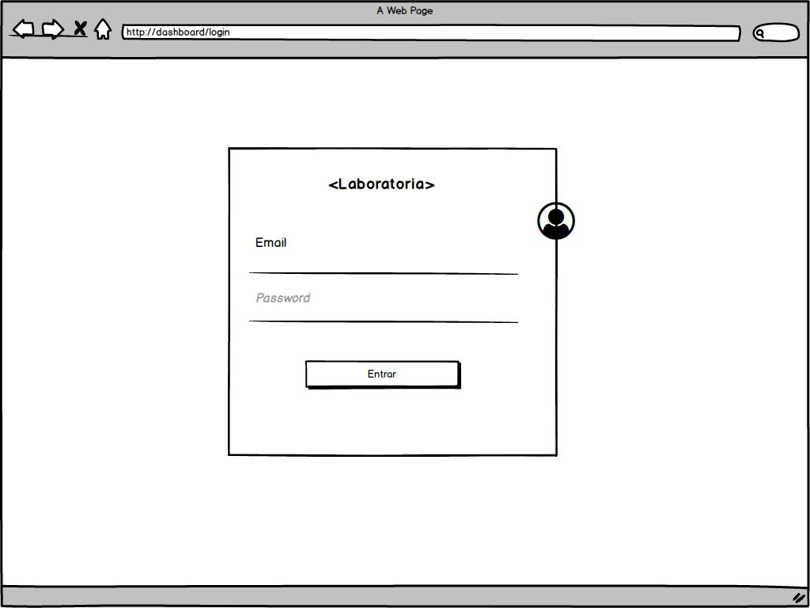
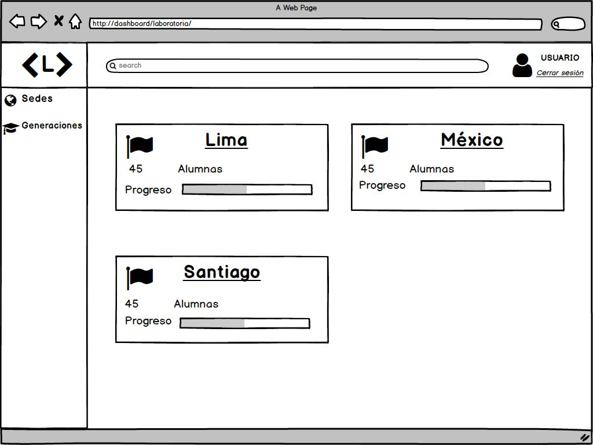
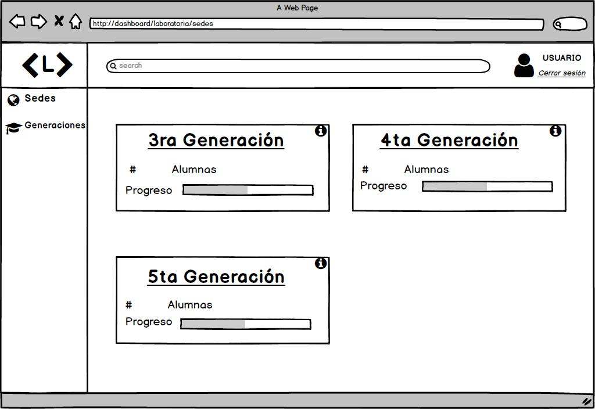
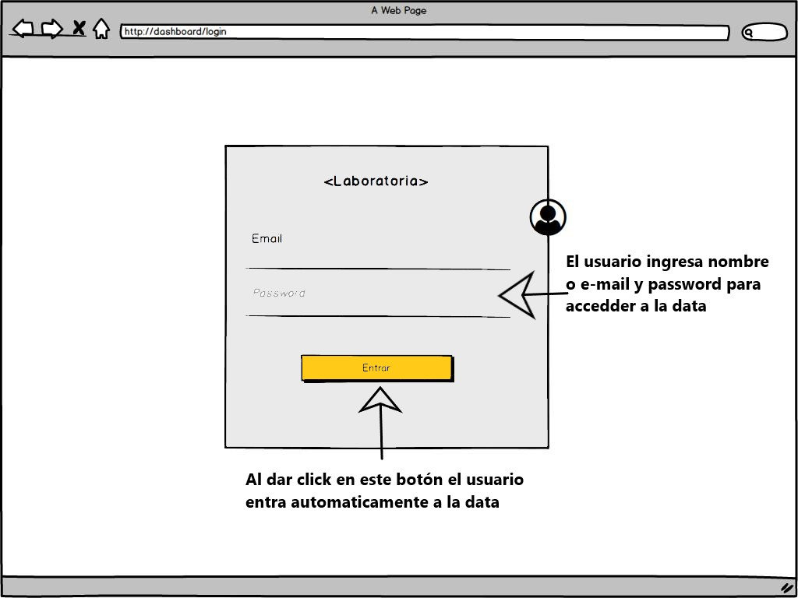
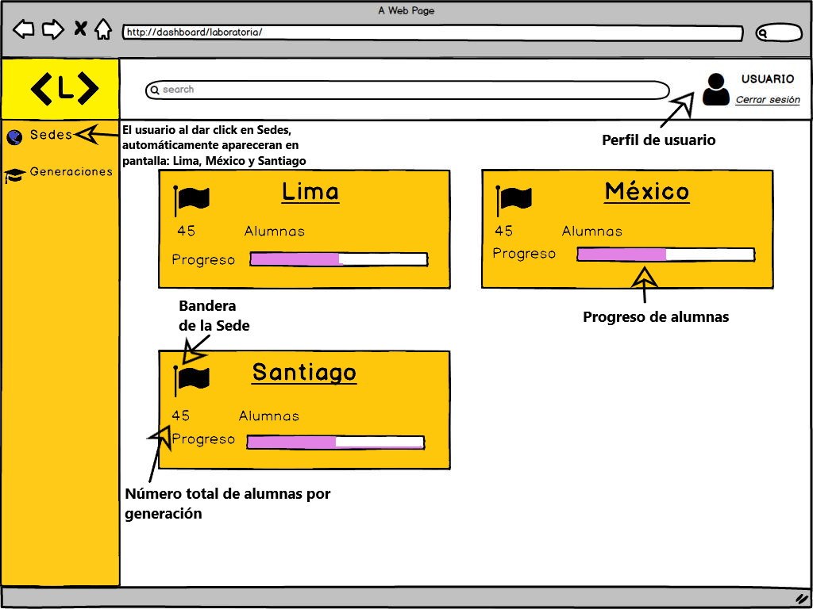
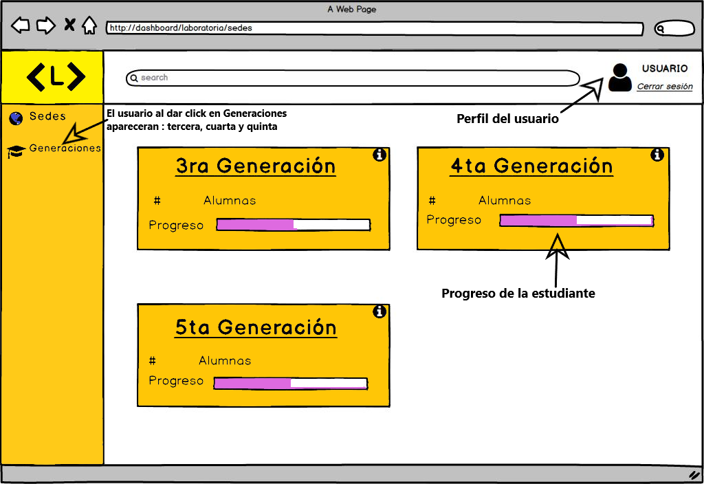

# **Data Dashboard**

## **Proceso de UX**

Nuestro primer acercamiento lo haremos a través del proceso de diseño, donde pasamos por diferentes etapas como:

### **1. Descubrimiento e investigación**
El data-dashboard es una herramienta utilizada por training  managers, coach y personal que interviene en la consecución de los objetivos de Laboratoria, y que está orientada a la toma de decisiones para optimizar la estrategia.
En este proyecto nuestro objetivo principal es crear una dashboard que permita al personal de Laboratoria principalmente TMs y Coaches monitorear el proceso de cada una de las alumnas (coders) dentro del Bootcamp y su interacción con el LMS (Learning Management System), este es un sistema de aprendizaje que permite a las estudiantes adquirir o reforzar conocimientos a través de lecturas, videos, ejercicios y quizzes.

La principal problemática de mi usuario es que actualmente Laboratoria no cuenta con un data dashboard y la información la manejan por medio de Excel pero el proceso para acceder es complicado  y les consume tiempo.

__Usuarixs:__  La información que recopilamos del personal de Laboratoria la obtuvimos mediante entrevistas a Lucile Baratier (Training Manager, CDMX) y Yujy (Alumni Network Manager, CDMX).

__Necesidades de las usuarias:__

__Objetivos de las usuarias:__ Nos dimos cuenta que la necesidad principal de crear un data-dasboard es poder visualizar la información de forma rápida y eficaz y que está a su vez sirva para tomar decisiones a tiempo, dar solución o mejorar aún más la experiencia.

Tomando en cuenta sus opiniones los datos a visualizar serían los siguientes:

* Sede del campus.
* Generación.
* Datos de la estudiante (nombre, e-mail, progreso y duración de temas).
* Número (porcentaje) de estudiantes que siguen activas vs las que desertaron
* Status inferior al 60% y superior al 90% de completitud
* Progreso general de generación y sedes 

En este dashboard trabajaremos con 3 Sedes:
* Lima
* CDMX
* Santiago

Así mismo las generaciones que estaremos trabajando serán tercera, cuarta y quinta.

Y estos datos estarían protegidos, ya que sólo personas autorizadas (que tengan usuario y contraseña) podrán acceder a dicha información.

Los usuarios estarían accediendo a la plataforma como mínimo 5 días a la semana  por medio de computadoras (escritorio o laptop) y celulares.

Así mismo queremos simplificar al máximo la usabilidad de la plataforma  para sea amigable, esto por medio de filtros de búsqueda, información precisa y clara, botones visibles y en el lugar adecuado y que la plataforma sea sencilla de usar para que así  nuestro usuario emplee su tiempo de manera asertiva y eficaz, permitiéndole realizar otras actividades de su vida cotidiana. 

__Pain points:__ (En sus actividades diarias qué es lo que más les molesta u obstaculiza en el proceso de  realizar sus actividades/objetivos)

__Sentimientos:__(Sentimientos que les surgen dentro del proceso de sus actividades. Identificar cuáles predominan)

__Técnicas usadas en esta fase:__ 

####Entrevista  Lucile Baratier (Training Manager, CDMX)

**Platicanos un poco de cómo accedes a la información de las alumnas.**
Actualmente no contamos con un data dashboard pero es super importante ya que un data básicamente es una manera de visualizar la información que te sirve para tomar decisiones.
Les daré un ejemplo muy sencillo: si en CDMX aceptamos a 90 estudiantes y en una semana se van 20 (probablemente sea porque algo estamos haciendo mal) y en Santiago solo se fueron 2, la data sirve para analizar y hablar con coaches y TMs y así generar una estrategia diferente.

**Nos comentas que no tienen data dashboard, nos gustaría saber ¿cuál es la forma en que manipulan la data?**
Usamos excel pero es muy complicado, tenemos que meternos en muchos archivos, no están filtrados y es difícil su manipulación, super lento y super largo.

**Ya has tenido alguna experiencia de usar un data dashboard fuera de Laboratoria?**
No, pero se muy bien el valor que me daría tenerlo y me ahorraría un buen de trabajo.

**Cuál sería el orden de importancia de la información?**
* Sedes
* Generación 
* Cuántas estudiantes están activas
* Cuantas estan activas vs inactivas
* Nivel de completitud
* Quienes están por debajo del 60% y por encima del 90% del LMS

**Consideras algo que no se mencionara que sea importante que esté en la interfaz?**
No sobrecargar la página y tener un filtrado, así como información global.

**Qué es lo más importante que debería de tener la data para ser manipulada por los TMs?**
Poder filtrar.

**Qué problemas has enfrentado con el manejo de datos manejandolos en excel?**
poca visibilidad que tienes, tienes que buscar para poder obtener un número y lo que el data te hace automáticamente uno lo tiene que hacer manualmente.

**Cómo podriamos mejorar tu experiencia de usuario?**
No necesariamente tienen que ser gráficas pueden ser números, pero si necesito saber el porcentaje, que sea muy visual para poder tomar una decisión de forma rápida porque la data es fácil de entender

**Qué dispositivos usarías para manipular la data?**
Computadora y celular

**Quiénes utilizarían el data?**
Principalmente los TMs, considero que lo más sencillo sería hacer un login para tener protegida la información

**Te gustaría agregar algo más a la data?**
Sí que pudieran crear perfiles, sería excelente, se los dejo en la mesa! 
Y recuerden que entre más sencillo mejor.

####Entrevista Yujy (Alumni Network Manager, CDMX).

**En qué dispositivo accederás al data dashboard?**
En una computadora, ya que es mucha información la que se visualiza, aunque también usaría celular en cuestiones especiales donde no tenga una computadora cerca.

 **Con qué frecuencia accederás a estos datos?**
Diario

**Cómo jerarquizarias la información?**
* Código de estudiante
* Nombre (datos personales)
* Generación 
* Sede

**Requieres que se agregue alguna data más?**
Si, como evolucionan las egresadas, tanto en el trabajo como en su vida personal, su situación económica, si siguen aprendiendo (cursos, talent land, etc) si necesitara sus meses de gracia (pago), etc.

**Crees necesario que se acceda a la información mediante un usuario?**
Sí, porque así vemos quien manipula la información y estaría genial!
Les recomiendo también que se pudiera actualizar datos (fueran modificables).

**Las herramientas que utilizas actualmente cubren tus necesidades?**
Si, pero son complejas, utilizamos Drive y manejo alrededor de 8 excel donde está toda la información en diferentes lugares.

**Te gustaría un filtro de búsqueda?**
Sí sería muy bueno.

__5. Objetivos del negocio:__ 

* Facilitar la visualización de información de las alumnas y que está a su vez sea clara y concisa.
* Darse cuenta a tiempo de problemáticas que se lleguen a presentar.
* Poder tomar decisiones de una forma más rápida y eficaz. 
* Ver la funcionalidad de estrategias y de ser necesario mejorarlas

__6. Motivaciones del negocio para el data dashboard:__
* Crear una mejor experiencia para el usuario y las alumnas.
* Aprovechar el tiempo.
* Focalizar problemas y realizar cambios.

__6. Proceso de diseño:__

Principalmente nos enfocamos en recopilar las necesidades y requerimientos de nuestro usuario.
Realizamos un pseudo-código para organizar la información obtenida
Por consiguiente hicimos un diagrama de flujo para entender las acciones que debía tener nuestro producto.
Pensamos en el diseño y colocación de botones para hacer la plataforma lo más amigable posible.
Hicimos varios bocetos de la visualización de nuestro producto.para llegar a nuestro sketch de baja fidelidad.

### **2. Síntesis y definición**
(Dada la fase anterior de investigación, ahora vamos a tomar todos los datos más importantes y transformarlos en información valiosa para comenzar a orientarse a la solución. También vamos a entender lo que la empresa quiere de ese producto y comenzar a entender ambas visiones con el fin de encontrar un punto armónico)

__1. Cuáles crees que son los datos más importantes a tener en cuenta para el Data Dashboard:__

   - Sobre las estudiantes:

   **Nombre**
   **Avance general de completitud de temas**
   **Estudiantes por debajo del 60%**
   **Estudiantes por encima del 90%**
   **Estudiantes activas e inactvas**
 

__2. Lo que los usuarios esperan obtener:__

__3. Insights:__

__4. Data proporcionada:__ 

     -_Data relacionada a los cursos:_

**Sedes**
**Generaciones(tercera, cuarta y quinta)**
**Estudiantes (nombre, correo, turno)**
**Porcentaje de complititud**
**Temas y subtemas (duración y porcentaje de completitud)**

__5. Insights del negocio:__

### **3. Ideación**
Para solucionar el problema de nuestro cliente pensamos en crear un data dashboard, el cual les permita a los TMs y personal de Laboratoria analizar la información de las estudiantes, así como ver el progreso en general de las otras sedes para poder resolver conflictos, ver avance general y poder realizar cambios o mejoras.

### **4. Prototipado**
A continuación mostramos nuestro sketch y prototipo los cuales son nuestro primer diseño pensando en las necesidades del usuario, en que fuera fácil de usar y manipular.

Sketch: 

Prototipo en figma: 

### **5. User testing**
(Si deseas validar tu propuesta, acércate a tu usuario y que te de feedback con el fin de mejorar tu producto en beneficio del negocio y de tu usuarix).

