# **Data Dashboard**

## **Proceso de UX**

Nuestro proceso de UX consiste en la investigacion del data dashboard, saber cual es su definición y sus alcances, a su vez hacer una investigación de como están implementados visualmente.

### **1. Descubrimiento e investigación**
Esta es una página web creada para la fácil consulta de información sobre las estudiantes del Bootcamp Laboratoria, pensada en específico para las personas en el puesto de Training Managers

__Usuarixs:__  
La Training Manager de la CDMX en entrevista nos comento que al no tener una data dashboard extraia la información que necesitaba de archivo Excel, en donde relizaba busquedas de manera manual. Haciendo largo, tedioso y estresante su trabajo.

__Necesidades de las usuarias:__  Tienen como necesidad primordial, analizar la data de las estudiantes con el fin de tomar las mejores decisiones con respecto al futuro de los procesos educativos; esto en una mejora continua de la experiencia de las estudiantes actuales y de las próximas generaciones.

__Objetivos de las usuarias:__
- Recabar la información de las alumnas de una manera agil
- Tener organizado por sedes y generaciones la información
- Saber el número exacto de alumnas que se encuentran por cada generación
- Saber el porcentaje de completitud en la que se encuentran las estudiantes  

__Pain points:__
- El no tener un sitio mas directo en donde consultar los datos, ya que lo realizan a base de archivos de Excel.
- El no contar con el numero total de estudiantes sin tener que hacer una suma total de las mismas.

__Sentimientos:__
- Frustración a la hora de buscar a alguna estudiante en específico, ya que como se comento anteriormente es a base de archivos.
- Estres cuando se tiene que abrir archivo por archivo para buscar lo deseado.

__Técnicas usadas en esta fase:__
###### Entrevista
Se le realizaron las siguientes preguntas para conocer sus necesidades.
* ¿Que herramienta utilizas actualmente?
* ¿Esta herramienta cubre tus necesidades?
* ¿Que le agregarias ha esta plataforma?
* ¿En que dispositivos te gustaría visualizar la información?
* ¿Con que frecuencia accedes a los datos?
* ¿Tienes alguna preferencia de jerarquia para que se presente la información?

###### Sketch
Se hizo un testeo con el usuario usando el sketch que muestra este documento posteriormente.

__5. Objetivos del negocio:__
* Mayor agilidad de la información.
* Facil lectura de la información.
* Detectar los bloqueos en el aprendizaje de las alumnas.
* Comparar la mejora de los procesos educativos entre sedes y generaciones.

__6. Motivaciones del negocio para el data dashboard:__
- Ayudar a más estudiantes actuales y proximas a ingresar.
- Ientificar las areas de oportunidad de los couch y jedi-master.

### **2. Síntesis y definición**
## Pseudocódigo
De acuerdo a la información recabada se realizó un pseudocodigo para entender el flujo de la información.

1.- Ingresar usuario y password.

2.- Aparece una pantalla con un menú de lado
izquierdo, y en la parte central una barra de búsqueda.

3.- Elegir entre los menús de lado izquierdo que es lo que se quiere visualizar:

* Sedes.

* Egresadas.

4.-Al seleccionar la Sede, accederás a las opciones:

* CDMX

* Guadalajara

* Lima

* Santiago

* Sao Paulo

5.- Cuando se selecciona una sede obtendrás las opciones de generación por sede. Al elegir una generación en automático arrojara un reporte general de la misma con los siguientes datos:

* Promedio general

* Numero de alumnas de esta generación

* Status LMS

    * Estudiantes con menos del 60% de completitud

    * Estudiantes con más del 90% de completitud.

6.- En caso de seleccionar Egresadas en el menú inicial, la pantalla mostrará un reporte general de las egresadas, donde se debe seleccionar una sede. Este reporte cuenta con la siguiente información:

* Sede

* Generación

* Total de Alumnas.

Y en formato tabla, la siguiente información por egresada:

 * Foto de perfil

 * Nombre

 * Correo

 * Opción a ordenar de "A" a "Z" o de "Z" a "A".

 7.-La última opción del menú da opción al usuario de enviar lo que ésta viendo en pantalla, como un reporte a su Correo Electrónico.

 ## Diagrama de Flujo
 El diagrama de flujo nos permite desarrollar el flujo de la información.

 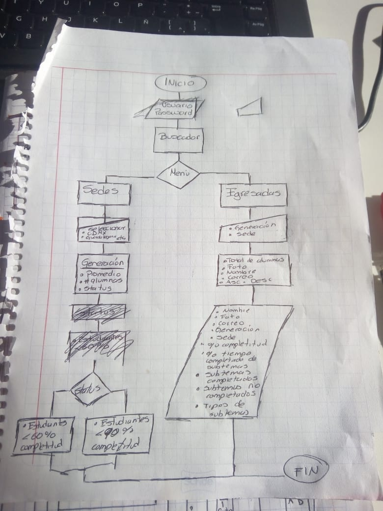

__1. Cuáles crees que son los datos más importantes a tener en cuenta para el Data Dashboard:__

- El numero de sedes que existen
- Saber cuantas generaciones hay por sede
- Saber el numero de alumnas por generación
- Obtener el avance de las alumnas en la plataforma del LMS

__2. Lo que los usuarios esperan obtener:__
Una data completa, agil y fácil de usar.

__3. Insights:__
- El numero de alumnas por generación y su porcentaje.
- Datos de las alumnas como nombre, correo, turno.

__4. Data proporcionada:__

* Por Sede

* Por Generación

* Por Alumna

    * Egresada

    * Actual

__5. Insights del negocio:__

### **3. Ideación**
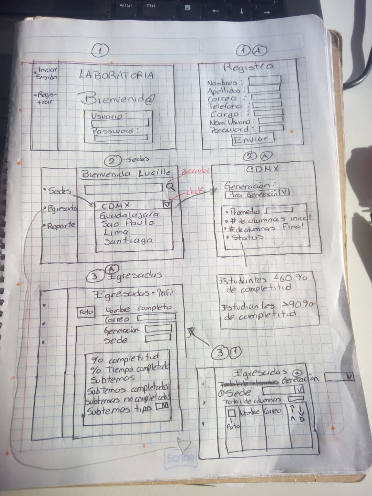

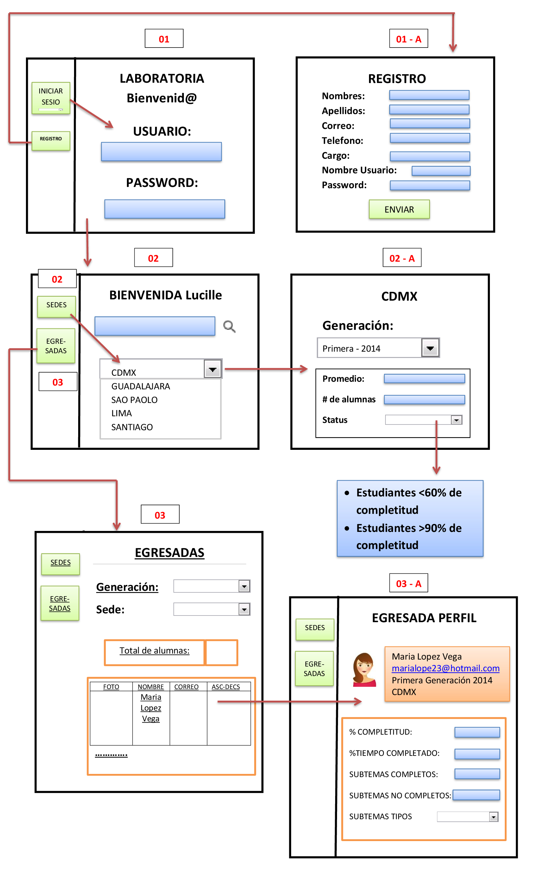

### **4. Prototipado**
Para la Data Dashboard se tomaron las siguientes consideraciones de acuerdo al Visual Desing.
La paleta de colores es:
* Una base blanca, para darle limpieza al proyecto y que la informacion no pierda protagonismo.
* Colores grises para los menus, y asi darle elegancia y sobriedad al proyecto.
* Se elige el color amarilo como fondo para la información, pensando en darle energia a la data y por ser los colores institucionales de Laboratoria.

 

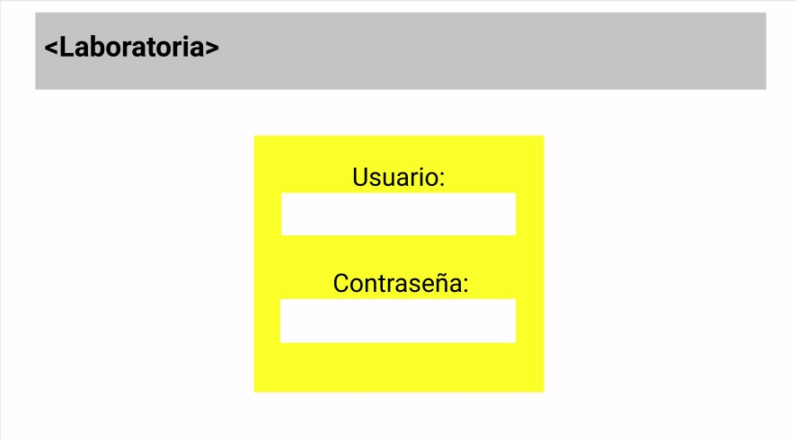

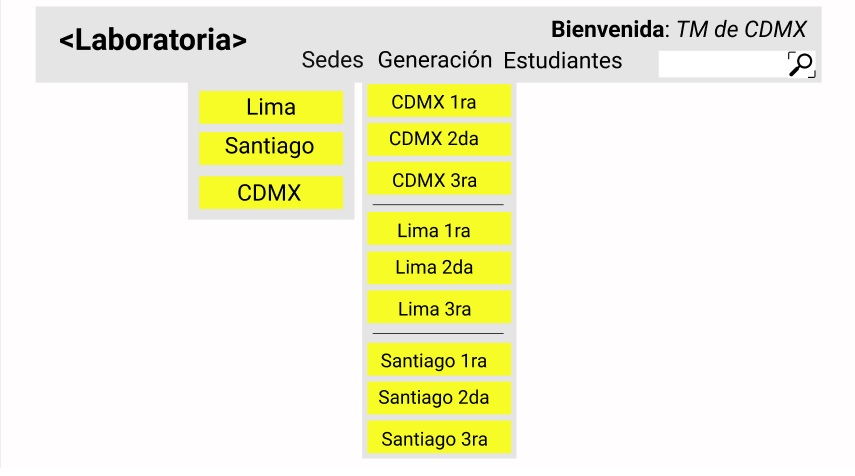

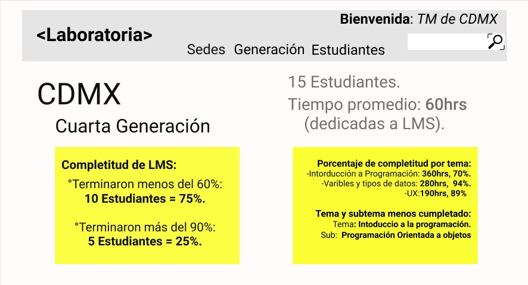

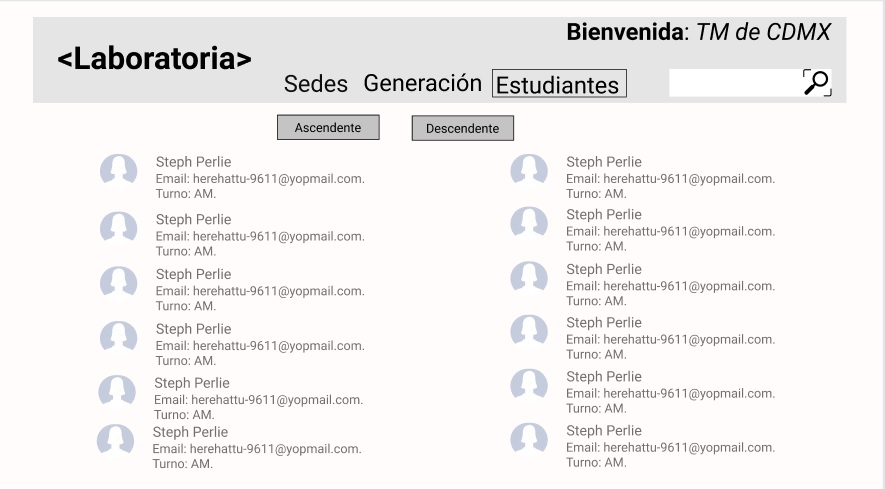

### **5. User testing**
## Producto final (Celular)

** INICIO DE SESION

Para acceder al sistema se deberá de ingresar los siguientes datos:

Nombre: admin
Contraseña: 123admin

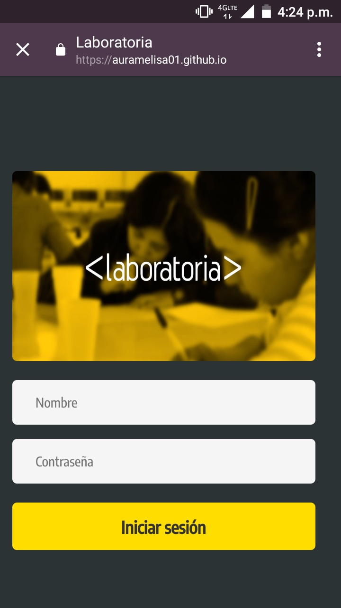

Pantalla de inicio contiene un carrusel que muestra imagenes de Laboratoria.

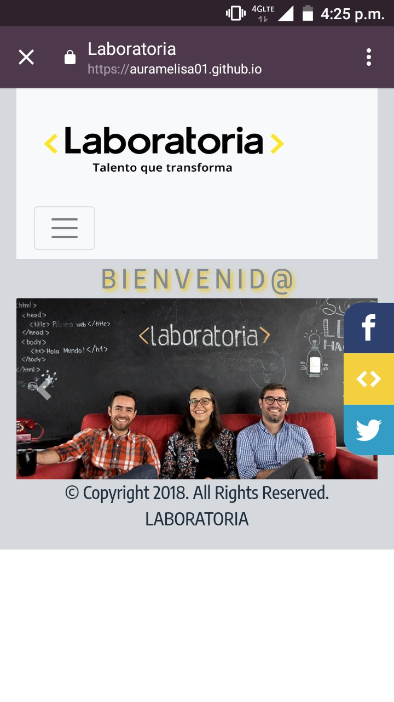

El menu desplegable contiene dos botones:

Porcentaje general: Dentro tiene otro boton de sedes.
Listado: Dentro tiene un boton de estudiantes.

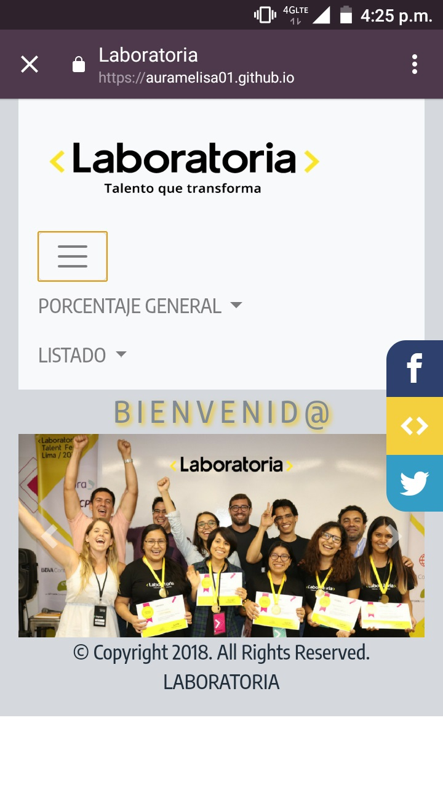

Pantalla del botón "porcentaje general".

Se muestra toda la información de la data por:
- Sede
- Generación
- Porcentaje de completitud en el LMS por generación
- Total de estudiantes por generación

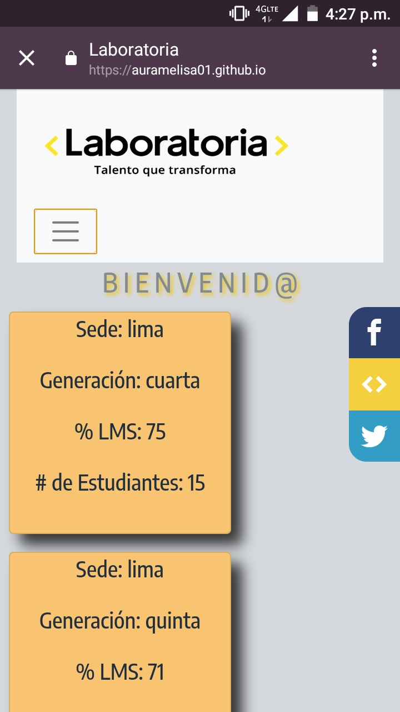

Pantalla del botón de "listado", donde se muestra toda la data de las estudiantes mostrando:
- Numero consecutivo
- Nombre
- Correo
- Turno
- Porcentaje de completitud en el LMS

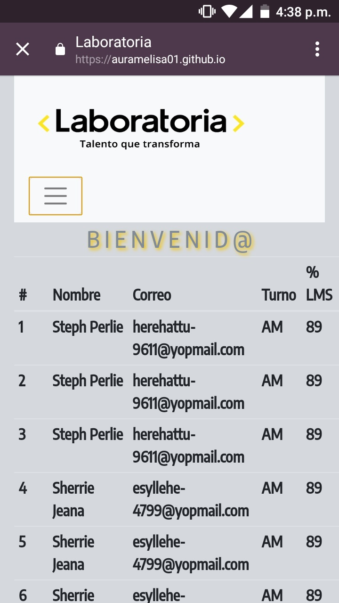
****
